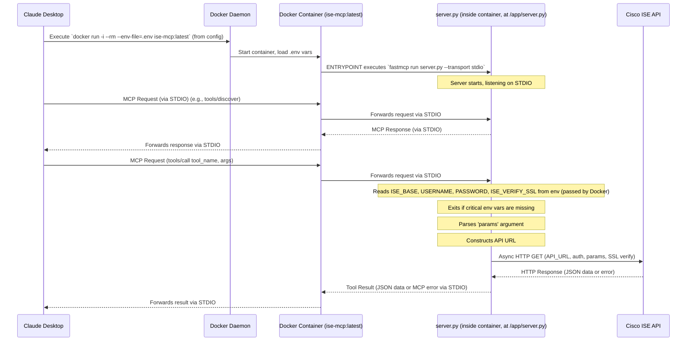

# System Patterns

## System Architecture

The `ise_mcp` server is a Python application designed to act as a Model Context Protocol (MCP) gateway to a Cisco ISE (Identity Services Engine) API.

**Core Components:**
1.  **`src/cisco/ISE/ise_mcp_server/server.py` (FastMCP Server Logic):**
    *   The main application logic for the MCP server.
    *   Uses the `fastmcp` library to implement an MCP server.
    *   Loads Cisco ISE API endpoint definitions from `src/cisco/ISE/ise_mcp_server/urls.json` (relative to the script, or `/app/urls.json` in Docker).
    *   Dynamically generates and registers MCP tools, one for each API endpoint.
    *   Defines Pydantic models (`FilterableToolInput`, `NonFilterableToolInput`) to structure tool arguments.
    *   Handles incoming MCP requests (e.g., `tools/discover`, `tools/call`).
    *   Includes an asynchronous main execution block (`_main_async`) for proper handling of async FastMCP methods.
    *   Uses `sys.exit(1)` if critical environment variables are missing.
2.  **`Dockerfile`:**
    *   Defines the Docker image `ise-mcp:latest`.
    *   Based on `python:3.11-slim`.
    *   Copies `requirements.txt` (from project root), `src/cisco/ISE/ise_mcp_server/server.py` (as `/app/server.py`), and `src/cisco/ISE/ise_mcp_server/urls.json` (as `/app/urls.json`) into the image.
    *   Installs Python dependencies.
    *   Sets `PYTHONUNBUFFERED=1`.
    *   Crucially, the `ENTRYPOINT` is configured to run the server with `stdio` transport for Claude Desktop compatibility:
        ```dockerfile
        ENTRYPOINT ["fastmcp", "run", "server.py", "--transport", "stdio"]
        ```
    *   Does **not** copy the `.env` file into the image.
3.  **`src/cisco/ISE/ise_mcp_server/urls.json` (Configuration File):**
    *   A JSON array defining the Cisco ISE API endpoints to be exposed as tools.
    *   Each entry specifies:
        *   `URL`: The relative path of the ISE API endpoint.
        *   `Name`: A human-readable name for the endpoint, used to derive the tool name.
        *   `FilterableFields`: An array of strings listing known filterable attributes for that endpoint (user-maintained).
4.  **Environment Variables (`.env` file):**
    *   Located in the project root (`/Users/berg276/mcp_servers/ISE_MCP/.env`).
    *   Stores sensitive configuration:
        *   `ISE_BASE`: The base URL of the Cisco ISE instance.
        *   `USERNAME`: Username for Cisco ISE API authentication.
        *   `PASSWORD`: Password for Cisco ISE API authentication.
        *   `ISE_VERIFY_SSL`: (Optional) Controls SSL certificate verification (`true`, `false`, or path to CA bundle).
    *   This file is **not** part of the Docker image but is loaded into the container at runtime by Docker itself (via `--env-file` in the `docker run` command used by Claude Desktop).
5.  **Dynamic Tool Functions (within `src/cisco/ISE/ise_mcp_server/server.py`):**
    *   Generated at runtime for each entry in `src/cisco/ISE/ise_mcp_server/urls.json` (or `/app/urls.json` in Docker).
    *   Each function is responsible for:
        *   Accepting an optional Pydantic model instance (`params: FilterableToolInput` or `params: NonFilterableToolInput`) as its argument, with `default_factory` ensuring an instance is created if no argument is passed.
        *   Extracting `filter_expression` and `query_params` from the `params` object.
        *   Constructing the full API request URL, including any filters.
        *   Making an asynchronous GET request to the Cisco ISE API using `httpx.AsyncClient`.
        *   Handling API responses and errors (including `httpx.HTTPStatusError` and `httpx.RequestError`), raising `ToolError` for client visibility.
        *   Returning the JSON response from ISE.
    *   These functions are registered with the `FastMCP` instance using `mcp.add_tool()`.

**Workflow (with Claude Desktop):**


## Key Technical Decisions

- **`fastmcp` Library:** Chosen for implementing the MCP server.
- **Docker for Deployment:** The server is packaged and run as a Docker container, especially for Claude Desktop integration.
- **STDIO Transport for Docker/Claude Desktop & Local `uv` execution:** The Docker image's `ENTRYPOINT` uses `stdio` transport. The `uv ... fastmcp run` command also specifies `stdio`.
- **`.env` File for Configuration:** Sensitive credentials and ISE base URL are managed in a `.env` file. This file is *not* part of the Docker image but loaded by Docker at runtime (via `--env-file`) or by `fastmcp run` when using `uv`.
- **Dynamic Tool Generation:** Tools are generated from `urls.json`.
- **Pydantic for Tool Arguments:** Tool functions accept a Pydantic model instance.
- **`httpx.AsyncClient` Library:** Used for asynchronous HTTP requests to Cisco ISE.
- **Asynchronous Main Execution:** The server logic in `src/cisco/ISE/ise_mcp_server/server.py` is asynchronous.
- **Graceful Exit:** `sys.exit(1)` is used if critical environment variables are missing.

## Design Patterns in Use

- **Factory Pattern (Implicit):** `create_tool_function` in `src/cisco/ISE/ise_mcp_server/server.py`.
- **Configuration File:** `src/cisco/ISE/ise_mcp_server/urls.json` for tool definitions, `.env` for runtime configuration.
- **Containerization:** Using Docker to package and run the application.

## Component Relationships

- Claude Desktop configuration points to `docker run` command.
- `docker run` uses the `ise-mcp:latest` image built from `Dockerfile`.
- `Dockerfile` copies `src/cisco/ISE/ise_mcp_server/server.py` (as `/app/server.py`) and runs it.
- The server script (`/app/server.py` inside the container) depends on `/app/urls.json` and environment variables (from `.env` via Docker).
- `src/cisco/ISE/ise_mcp_server/server.py` uses `fastmcp`, `httpx`, `pydantic`, `python-dotenv`, etc.

## Critical Implementation Paths
- **Dockerfile `ENTRYPOINT`:** Must correctly specify `stdio` transport.
- **Claude Desktop Configuration:** Must use `docker run` with `-i` and `--env-file` pointing to the host's `.env` file.
- **`.env` File Handling:** Ensuring Docker correctly loads variables from the host's `.env` file into the container.
- **Tool Generation Loop & API Call Logic:** As previously defined.
