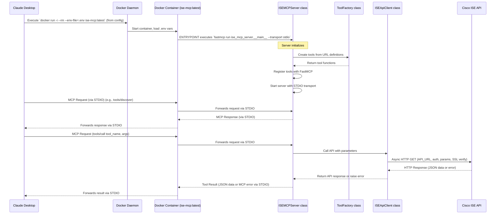

# System Patterns

## System Architecture

The `ise_mcp` server is a Python application designed to act as a Model Context Protocol (MCP) gateway to a Cisco ISE (Identity Services Engine) API. It has been restructured with a modular architecture.

**Core Components:**
1.  **Modular Package Structure:**
    *   The server is now organized as a proper Python package with clear separation of concerns:
    ```
    src/
    └── ise_mcp_server/
        ├── __init__.py
        ├── __main__.py          # Command-line entry point
        ├── server.py            # Main server class
        ├── config/              # Configuration-related modules
        │   ├── __init__.py
        │   ├── settings.py      # Environment variables and settings
        │   ├── urls.json        # URL definitions for the API endpoints
        │   └── urls_config.py   # Functions to load URLs configuration
        ├── core/                # Core functionality
        │   ├── __init__.py
        │   ├── models.py        # Pydantic models for tool inputs
        │   └── utils.py         # Utility functions
        ├── api/                 # API client
        │   ├── __init__.py
        │   └── client.py        # ISE API client
        └── tools/               # Tool-related modules
            ├── __init__.py
            └── factory.py       # Tool factory
    ```

2.  **`src/ise_mcp_server/server.py` (Main Server Class):**
    *   Now implemented as a class `ISEMCPServer` that encapsulates the server logic.
    *   Uses the `fastmcp` library to implement an MCP server.
    *   Delegates URL loading to the `config.urls_config` module.
    *   Delegates tool creation to the `tools.factory` module.
    *   Delegates API communication to the `api.client` module.
    *   Handles server lifecycle (initialization, tool registration, startup).
    *   Includes an asynchronous `start()` method for proper handling of async FastMCP methods.

3.  **`src/ise_mcp_server/__main__.py` (CLI Entry Point):**
    *   New module that provides a command-line interface.
    *   Parses command-line arguments for host, port, and transport.
    *   Creates and starts an instance of `ISEMCPServer`.
    *   Enables running the server as a module with `python -m src.ise_mcp_server`.

4.  **`src/ise_mcp_server/config/settings.py` (Configuration):**
    *   Centralized configuration management.
    *   Loads environment variables from `.env` file.
    *   Validates critical settings.
    *   Determines SSL verification configuration.
    *   Defines default server settings.

5.  **`src/ise_mcp_server/config/urls_config.py` (URL Configuration):**
    *   Responsible for loading the URL definitions from JSON.
    *   Handles file location resolution and error handling.
    *   Returns a list of URL definitions.

6.  **`src/ise_mcp_server/core/models.py` (Data Models):**
    *   Defines Pydantic models for tool arguments.
    *   `FilterableToolInput` for endpoints that support filtering.
    *   `NonFilterableToolInput` for endpoints that don't support filtering.

7.  **`src/ise_mcp_server/core/utils.py` (Utilities):**
    *   Common utility functions.
    *   Name sanitization for tool names.
    *   Function to generate tool docstrings.
    *   Filter expression processing.

8.  **`src/ise_mcp_server/api/client.py` (API Client):**
    *   Encapsulates API communication logic.
    *   Makes asynchronous GET requests to Cisco ISE using `httpx.AsyncClient`.
    *   Handles authentication and SSL verification.
    *   Processes API responses and errors.

9.  **`src/ise_mcp_server/tools/factory.py` (Tool Factory):**
    *   Implements the Factory Pattern explicitly.
    *   Creates tool functions from URL definitions.
    *   Determines the appropriate input model based on filtering support.
    *   Sets tool name and docstring.

10. **`Dockerfile` (Updated):**
    *   Now installs the entire package.
    *   Uses `setup.py` to make the package installable.
    *   Updated `ENTRYPOINT` to use the module directly:
    ```dockerfile
    ENTRYPOINT ["python", "-m", "ise_mcp_server", "--transport", "stdio"]
    ```

11. **`setup.py` (Top-level):**
    *   Makes the package installable with pip using src-layout.
    *   Defines package metadata and dependencies.
    *   Registers a console script entry point `ise-mcp-server`.

12. **Environment Variables (`.env` file):**
    *   Same as before, located in the project root.
    *   Stores sensitive configuration for ISE connection.
    *   Not part of the Docker image but loaded at runtime.

**Workflow (with Claude Desktop):**


## Key Technical Decisions

- **Modular Architecture:** Reorganized code into logical modules with clear separation of concerns.
- **Explicit Class Structure:** Replaced loose functions with explicit classes for better encapsulation.
- **`fastmcp` Library:** Continues to be the core library for implementing the MCP server.
- **Docker for Deployment:** Updated for the new structure but maintains the same deployment approach.
- **Package Structure:** Now organized as a proper Python package with `setup.py` for installation.
- **CLI Module:** Added proper command-line argument parsing and entry point.
- **`.env` File for Configuration:** Maintained the same approach for sensitive credentials.
- **Explicit Factory Pattern:** Replaced implicit factory with a dedicated `ToolFactory` class.
- **API Client:** Encapsulated API communication in a dedicated client class.
- **`httpx.AsyncClient` Library:** Continued use for asynchronous HTTP requests.
- **Asynchronous Operation:** Maintained throughout the codebase.
- **Graceful Exit:** Maintained for critical configuration issues.

## Design Patterns in Use

- **Factory Pattern (Explicit):** `ToolFactory` class in `tools/factory.py`.
- **Singleton Pattern (Implicit):** Single instance of server, factory, and client classes.
- **Dependency Injection (Implicit):** Factory and client instances provided to server.
- **Configuration Object:** Centralized settings in `config/settings.py`.
- **Repository Pattern:** `ISEApiClient` encapsulates data access.
- **Command Pattern (Implicit):** CLI commands processed by `__main__.py`.
- **Facade Pattern:** `ISEMCPServer` provides a simplified interface to the underlying components.
- **Containerization:** Using Docker to package and run the application.

## Component Relationships

- Claude Desktop configuration points to `docker run` command.
- `docker run` uses the `ise-mcp:latest` image built from the updated `Dockerfile`.
- `Dockerfile` installs the entire package and runs it via the `__main__` module.
- The `ISEMCPServer` class uses `ToolFactory` to create tools and FastMCP to expose them.
- The `ToolFactory` uses `ISEApiClient` for API communication.
- All components use the centralized configuration from `config/settings.py`.

## Critical Implementation Paths

- **Package Structure:** Must maintain proper Python package conventions.
- **Module Imports:** Must use correct relative imports between modules.
- **Dockerfile `ENTRYPOINT`:** Must correctly specify the module path and transport.
- **Claude Desktop Configuration:** Must continue to use `docker run` with proper arguments.
- **`.env` File Handling:** Ensuring Docker correctly loads variables from the host's `.env` file.
- **URLs Configuration Loading:** Must handle both old and new file locations for backward compatibility.