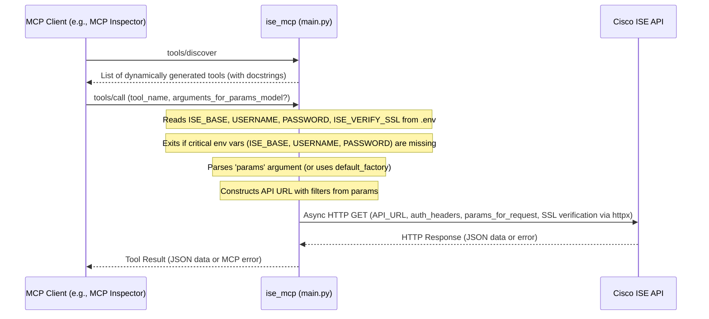

# System Patterns

## System Architecture

The `ise_mcp` server is a Python application designed to act as a Model Context Protocol (MCP) gateway to a Cisco ISE (Identity Services Engine) API.

**Core Components:**
1.  **`main.py` (FastMCP Server):**
    *   The main application entry point.
    *   Uses the `fastmcp` library to implement an MCP server.
    *   Loads Cisco ISE API endpoint definitions from `urls.json`.
    *   Dynamically generates and registers MCP tools, one for each API endpoint.
    *   Defines Pydantic models (`FilterableToolInput`, `NonFilterableToolInput`) to structure tool arguments.
    *   Handles incoming MCP requests (e.g., `tools/discover`, `tools/call`).
    *   Communicates with clients via `streamable-http` transport by default (as configured in `_main_async`).
    *   Includes an asynchronous main execution block (`_main_async`) for proper handling of async FastMCP methods.
    *   Uses `sys.exit(1)` if critical environment variables are missing.
2.  **`urls.json` (Configuration File):**
    *   A JSON array defining the Cisco ISE API endpoints to be exposed as tools.
    *   Each entry specifies:
        *   `URL`: The relative path of the ISE API endpoint.
        *   `Name`: A human-readable name for the endpoint, used to derive the tool name.
        *   `FilterableFields`: An array of strings listing known filterable attributes for that endpoint (user-maintained).
3.  **Environment Variables (`.env` file):**
    *   Stores sensitive configuration:
        *   `ISE_BASE`: The base URL of the Cisco ISE instance.
        *   `USERNAME`: Username for Cisco ISE API authentication.
        *   `PASSWORD`: Password for Cisco ISE API authentication.
        *   `ISE_VERIFY_SSL`: (Optional) Controls SSL certificate verification (`true`, `false`, or path to CA bundle).
4.  **Dynamic Tool Functions:**
    *   Generated at runtime within `main.py` for each entry in `urls.json`.
    *   Each function is responsible for:
        *   Accepting an optional Pydantic model instance (`params: FilterableToolInput` or `params: NonFilterableToolInput`) as its argument, with `default_factory` ensuring an instance is created if no argument is passed.
        *   Extracting `filter_expression` and `query_params` from the `params` object.
        *   Constructing the full API request URL, including any filters.
        *   Making an asynchronous GET request to the Cisco ISE API using `httpx.AsyncClient`.
        *   Handling API responses and errors (including `httpx.HTTPStatusError` and `httpx.RequestError`), raising `ToolError` for client visibility.
        *   Returning the JSON response from ISE.
    *   These functions are registered with the `FastMCP` instance using `mcp.add_tool()`.

**Workflow:**

## Key Technical Decisions

- **`fastmcp` Library:** Chosen for implementing the MCP server.
- **Dynamic Tool Generation:** Tools are generated from `urls.json`.
- **Pydantic for Tool Arguments:** Tool functions accept a Pydantic model instance (`FilterableToolInput` or `NonFilterableToolInput`) as an argument. This argument is made optional using `pydantic.Field(default_factory=InputModelType)` to handle calls from clients (like MCP Inspector) that might not provide explicit arguments. This ensures robust validation and schema generation.
- **Configuration via `urls.json` and `.env`:** Standard, including SSL verification options.
- **`httpx.AsyncClient` Library:** Used for asynchronous HTTP requests to Cisco ISE.
- **Filtering Implementation:** Generic `filter_expression` and `query_params` are extracted from the Pydantic model instance.
- **Docstring Generation:** Standard.
- **Asynchronous Main Execution:** The server startup logic (including fetching tool count) is in an `async` function, and `mcp.run_async()` is used with `streamable-http` transport.
- **Explicit `mcp.dependencies`:** Set to `[]` for compatibility with `fastmcp dev`.
- **Graceful Exit:** `sys.exit(1)` is used if critical environment variables are missing.

## Design Patterns in Use

- **Factory Pattern (Implicit):** `create_tool_function` in `main.py`.
- **Configuration File:** `urls.json`.
- **Model-View-Controller (MVC) variant (Conceptual):**
    - **Model:** The data structures defined by Pydantic (`FilterableToolInput`, `NonFilterableToolInput`) and the data returned by ISE.
    - **View (Interface):** The MCP tools exposed to the client.
    - **Controller:** The logic within `main.py` that handles requests, interacts with ISE, and formats responses.
- **Dependency Injection (via `fastmcp` and Pydantic):** FastMCP injects context if needed, and Pydantic handles the creation/validation of the `params` model instance.

## Component Relationships

- `main.py` is the central orchestrator.
- `main.py` depends on `urls.json`.
- `main.py` uses `dotenv`, `fastmcp`, `httpx`, `pydantic`, `sys`, `asyncio`, `logging`, `json`, `os`, `pathlib`.

## Critical Implementation Paths

- **Tool Generation Loop:** Includes creation of tool functions with correct Pydantic model argument handling (`default_factory`).
- **API Call Logic:** Within `specific_tool_function`, ensuring `params` object is correctly accessed.
- **Server Startup:** The `_main_async` function correctly using `await mcp.get_tools()` and `await mcp.run_async()`.
